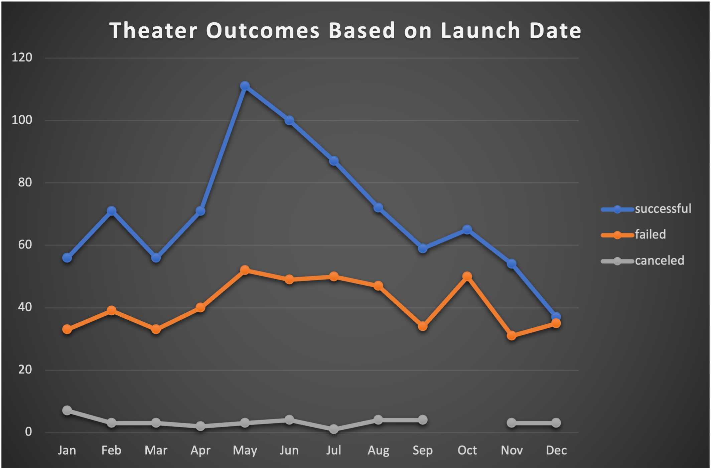

# "An Analysis of kickstarter Campaigns"
Performing analysis on Kickstarter data to uncover trends
# Kickstarting with Excel

## Overview of Project
Theater outcome based off of launch date
### Purpose
Determine theatre/play outcomes based on funding and goal amount and which are most successful.
## Analysis and Challenges
Pulled theater goal data from 2009-2017 and put into a pivot table to analyze successful, failed and cancelled outcomes that can sorted by months and years. I used a line chart to demonstrate the analysis. I created an additional line chart to show percentages of successful, failed and cancelled outcomes for plays as a whole. I had difficulty using the countifs formula. I overcame by watching numerous tutorials, asking questions and applying it thru trial and error till it made sense. I also used the line chart in the module as a guide.
### Analysis of Outcomes Based on Launch Date
Year 4 began to have the most launches. May thru August were the most successful months to launch with May being the high point with 166 launches and 111 were successes followed by 52 failures and 3 canclled.

### Analysis of Outcomes Based on Goals
The most successful outcomes were plays that were under $1,000 where 75% were successfull followed by $1000 to $4,999 where 73% were successful.

### Challenges and Difficulties Encountered

## Results

- What are two conclusions you can draw about the Outcomes based on Launch Date?
May thru August bring in the most success and it takes about 4 years to start seeing results and build launches.
- What can you conclude about the Outcomes based on Goals?
Plays that stick under a budget of $5,000 stand the biggest chance to succeed. Plays over a $50,000 budget have a very low chance to succeed.
- What are some limitations of this dataset?
Doesn't show how the funds for each play were spread. Did some have more advertising than others? Were the more expensive plays advertised enough or did too much go into production cost?
- What are some other possible tables and/or graphs that we could create?
Genre of plays in a bar graph. Successful, Failed and Cancelled plays in a line graph to show which faired better based on when the plays were launced and the deadline.  
